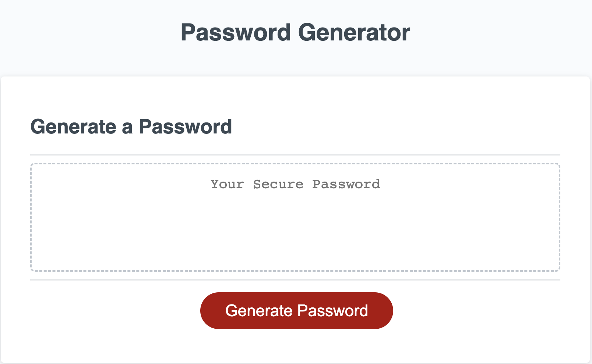
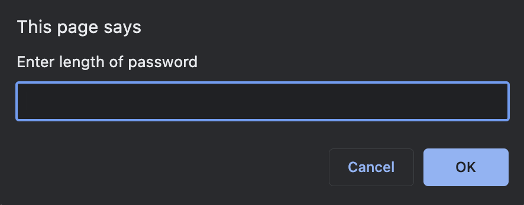
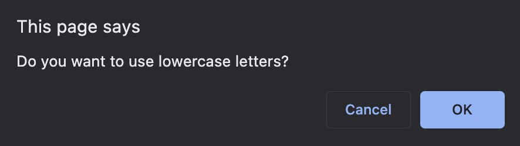
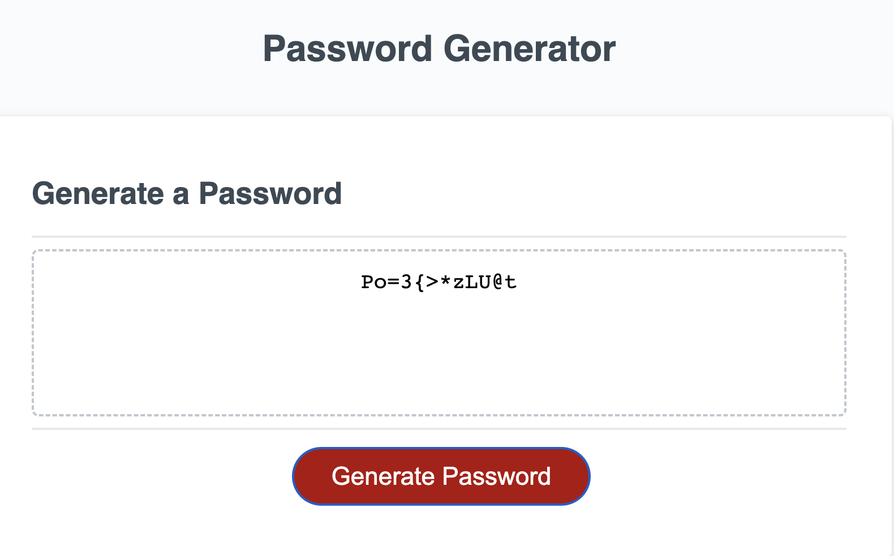

# password-generator
[](code_of_conduct.md)

## The Repository

This repository contains javascript code to power a password generator. Starter code was provided by Columbia Coding Bootcamp.

---

## Installation

The code may be accessed on [GitHub](https://github.com/choelzli/password-generator) or visiting the site URL (https://choelzli.github.io/password-generator/).

Clone the repo:
```
git clone https://github.com/choelzli/password-generator.git
```

---

## Usage

Upon accessing the webpage, it displays a title, header, empty field with default text, and a button to initiate the password generator.  



Clicking the button prompts the user to provide responses on password length and character options.  

 

After completing the prompts, the generated password is displayed in the text field.


---

## License

Licensed under the MIT license.

---

## Credits

Base code strategies provided by Columbia Coding Bootcamp. Other sources include:
* [The Contributor Covenant](https://www.contributor-covenant.org/)
* [HereWeCode: Array to String Without Commas in Javascript](https://herewecode.io/blog/array-to-string-without-commas-javascript/#:~:text=In%20JavaScript%2C%20all%20arrays%20have,all%20the%20array%20elements%20concatenated.)
* [MDN Web Docs: Array.prototype.concat()](https://developer.mozilla.org/en-US/docs/Web/JavaScript/Reference/Global_Objects/Array/concat)
* [MDN Web Docs: Array.prototype.push()](https://developer.mozilla.org/en-US/docs/Web/JavaScript/Reference/Global_Objects/Array/push)
* [MDN Web Docs: return](https://developer.mozilla.org/en-US/docs/Web/JavaScript/Reference/Statements/return)
* [MDN Web Docs: Array.prototype.splice()](https://developer.mozilla.org/en-US/docs/Web/JavaScript/Reference/Global_Objects/Array/splice)
* [MDN Web Docs: Math.random()](https://developer.mozilla.org/en-US/docs/Web/JavaScript/Reference/Global_Objects/Math/random)
* [README Template](https://github.com/othneildrew/Best-README-Template)
* [Stack Overflow: Difference between concat and push?](https://stackoverflow.com/questions/44572026/difference-between-concat-and-push)
* [VS Code README](https://github.com/microsoft/vscode/tree/main)